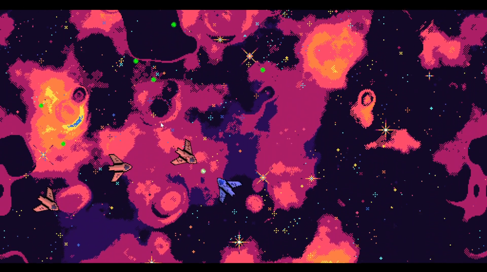
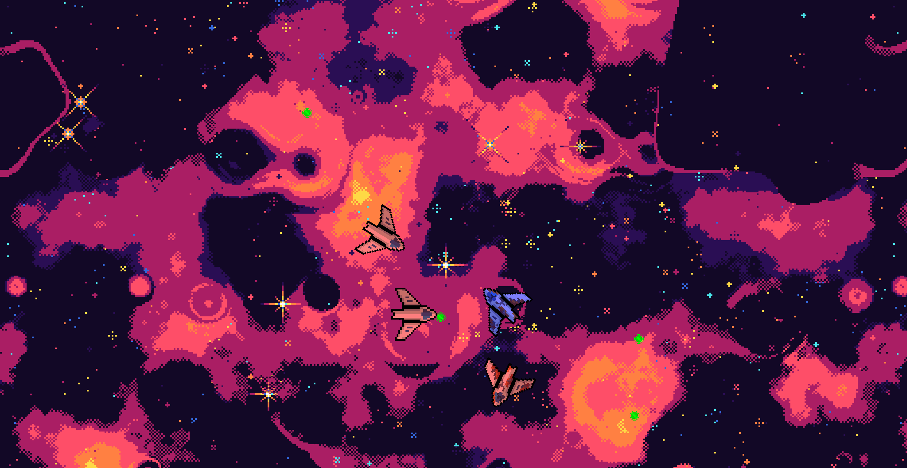
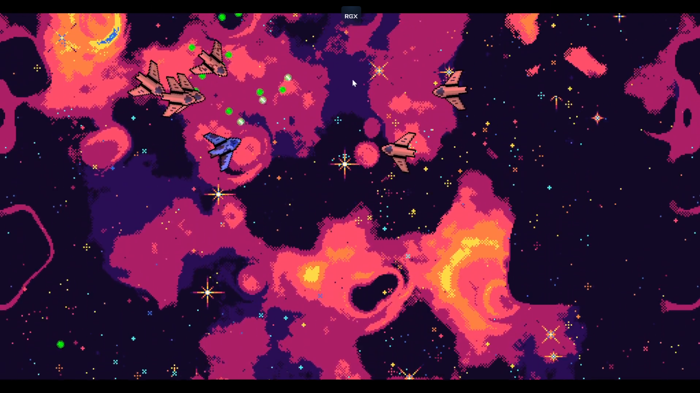

# BulletHell

### Description

Small bullet hell style game made with C++ and SFML.

### Features

 - Defeat all enemies to get to the next round
 - Increasing difficulty 
 - Endless gameplay

### Controls

Keyboard:
 - W, A, S, D: movement
 - Mouse cursor: aim direction
 - Left click: shoot
 - R: restart game

### Screenshots

